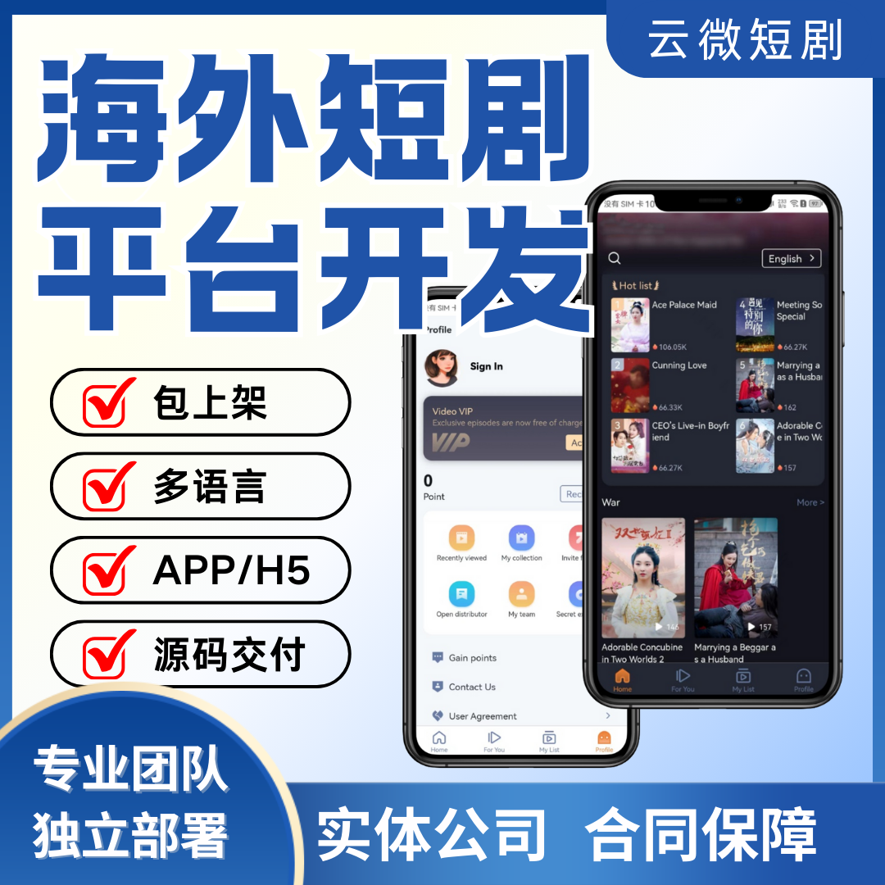

# 海外短剧 H5 系统搭建｜无需 APP 上架 低成本跨境引流快速变现

### 一、前言

相比国内短剧内卷严重，东南亚、中东、欧美短剧市场流量充足、竞争更小、付费意愿强。但很多跨境创业者不敢做 APP：审核严、封号率高、上架费用贵、包体适配麻烦。

海外短剧H5 页面成为目前最优出海方案：不用上架、无需安装、点开即播、分发无限制，适配全部海外社交平台，是跨境短剧低成本变现的主流模式。

### 二、海外 APP 出海常见痛点

- APP 上架审核严格，资质要求高、驳回率极高；
- 多国地区权限管控严，容易下架、封禁应用；
- 开发打包成本昂贵，适配安卓 iOS 投入成本高；
- APP 无法外链投放，引流渠道受限；
- 运营试错成本高，前期投入大、回本周期长。

### 三、海外 H5 短剧系统核心优势

#### 1. 无需 APP 上架，零审核门槛
H5 无需应用商店审核，不受平台管控，无下架封号风险。独立域名部署、自由分发，可任意投放 TikTok、Facebook、谷歌广告、社群私域，是跨境最安全的分发载体。

#### 2. 国际化多语言 + RTL 排版
- 内置全球语言包，支持英语、泰语、越南语、阿拉伯语等语种；
- 适配中东 RTL 反向排版，覆盖全球主流市场，前台一键切换语言，贴合当地人使用习惯。

#### 3. 全球 CDN 极速播放
对接海外跨境节点，视频加密分发、自适应码率，欧美、东南亚、中东地区低延迟秒开，解决跨境加载慢、卡顿、黑屏问题，大幅提升用户留存。

#### 4. 跨境支付自动结算
深度集成 PayPal、Stripe、Apple Pay、Google Pay，支持多币种实时汇率换算，美金、欧元、本地货币自由切换。充值原路退款、自动对账，资金合规直达商户。

#### 5. 双模式多元变现
- 免费用户观看激励广告解锁剧集，承接海外广告联盟流量收益；
- 精准用户开通会员、单片点播、超前点播付费盈利。
- 广告 + 付费双模式并行，最大化挖掘跨境流量价值。

#### 6. 跨境裂变推广体系
自带海外推客分佣系统，生成专属推广短链，支持渠道达人、海外博主分销引流。自动统计归属、智能分佣，低成本扩大海外流量池。

### 四、系统技术架构

采用 Vue3+SpringBoot 成熟架构，轻量化 H5 响应式布局，适配所有手机浏览器。后台可视化管理，剧集批量上传、权限分级、风控防盗、数据统计全部内置，无需二次开发，部署即可运营。

### 五、适用人群

跨境流量工作室、TikTok 投放团队、海外私域博主、文化传媒公司、短剧出海新手、不想投入高额成本开发 APP 的创业者。

## 🤝 商务微信：ywyy6798

- 海外短剧想要低风险、快落地、低成本运营，H5 是现阶段最优入局方式。
- 无需 APP 上架、不用复杂资质、全球任意渠道投放。
- 搭配多语言、多币种、全球 CDN、跨境支付能力，快速实现跨境引流、自动变现。

广州云微传媒提供海外短剧 H5 搭建、域名服务器部署、支付对接、广告配置、贴牌定制一站式服务，快速搭建属于自己的海外短剧盈利平台。

