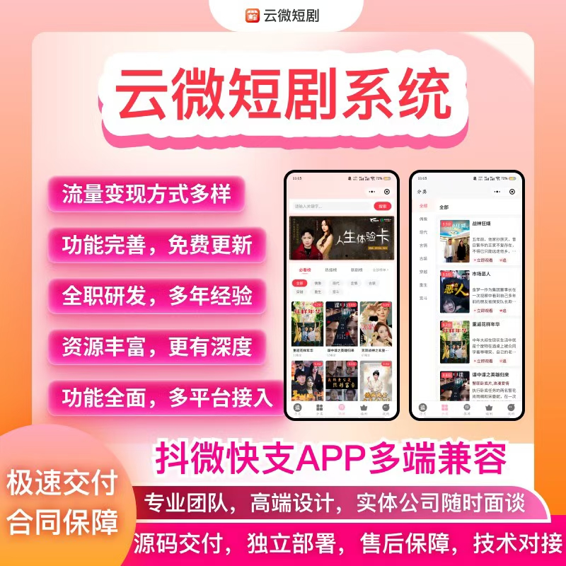

# 云微短剧系统开发｜多端兼容短剧平台解决方案

### 一、项目介绍

聚焦短剧行业的核心痛点，提供多端兼容系统 + 合规资质办理 + 项目资源对接的全链条解决方案，覆盖从系统搭建到商业化运营的全流程需求。实体公司保障，合同签订，支持随时面谈，为您的短剧项目保驾护航。

### 二、多端兼容系统：布局全域流量

一套代码适配多平台，轻松覆盖全域流量，无需重复开发，降低成本，提升效率。
- 小程序矩阵：支持微信、抖音、快手、支付宝小程序，适配各平台规则，快速上线获客
- 多终端覆盖：APP＋H5 网页端，满足用户多场景访问需求
- 数据打通：多端用户数据、订单数据统一管理，运营决策更精准

### 三、一站式企业服务：解决合规与资质痛点

短剧业务合规先行，我们提供专业资质办理服务，让您无需繁琐流程，专注业务增长：
- 公司注册服务
- 资质办理：ICP许可证、广播节目制作经营许可证、文网文许可证等
- 内容资源：短剧拍摄制作、正版片源授权合作
- 合规指导：内容合规审核、平台上架规则适配，保障业务稳定运营

### 四、核心功能与保障

 **功能完善，持续迭代** 
- 功能完善：高清播放、用户管理、内容分发、支付结算、数据统计等全套功能
- 用户运营：会员等级、积分商城，提升用户留存与传播
- 多样变现：会员订阅、单剧付费、广告植入、电商带货，多元变现
- 持续更新：系统功能持续迭代，紧跟行业趋势，无需额外付费

 **专业技术保障** 
- 源码交付：提供完整源代码，确保技术自主可控
- 独立部署：支持私有化部署，数据安全有保障
- 专业团队：全职研发团队，多年行业开发经验
- 全程护航：售前咨询、技术对接、售后支持一体化服务
- 合同保障：正规合同签订，极速交付承诺
- 实体公司：可随时面谈合作，建立长期信任关系

### 五、合作咨询

如果您对我们的短剧系统解决方案感兴趣，欢迎通过以下方式联系我们
#### 商务微信：ywyy6798
#### 合作类型：
- 系统定制开发
- 源码购买与部署
- 资质办理咨询
- 片源合作洽谈
- 运营投流合作
