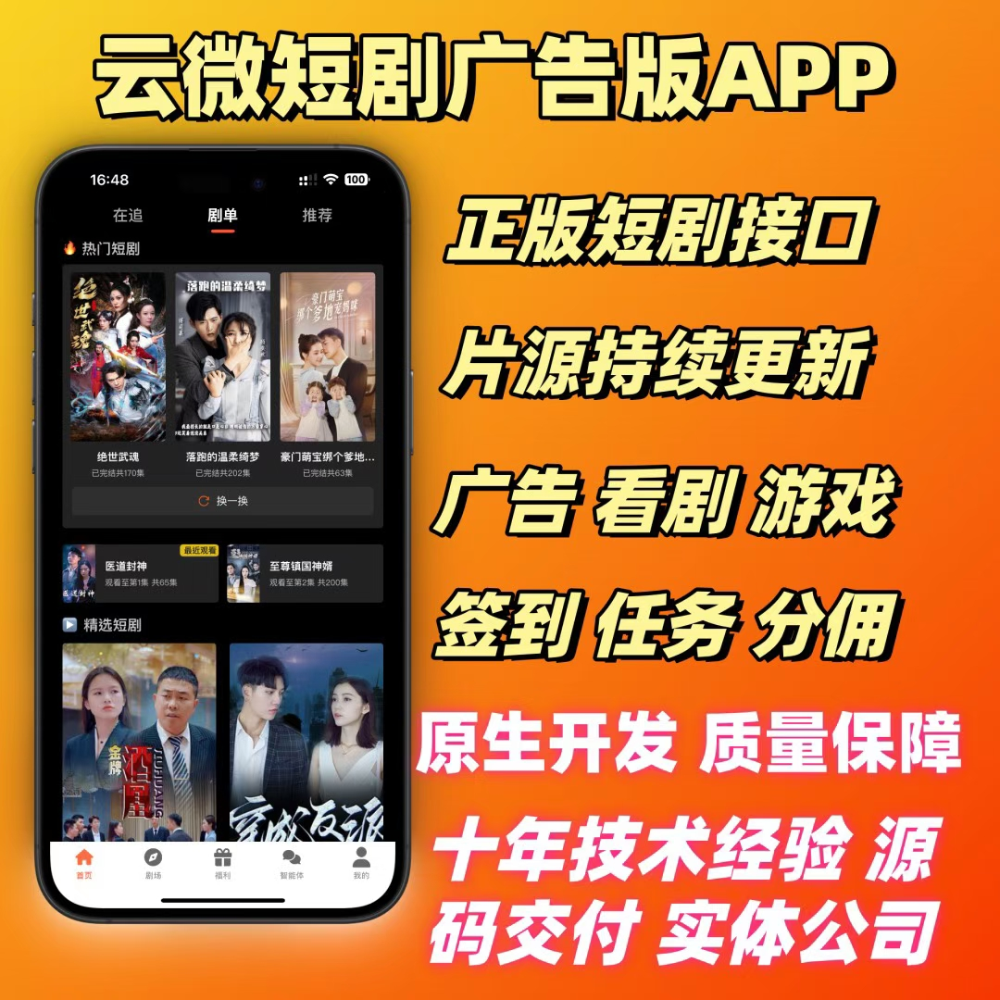

# 短剧广告联盟APP开发 | 一站式搭建高变现看广告解锁短剧平台

专注短剧广告联盟全栈开发，为创业者搭建“看广告解锁短剧”高变现平台，提供原生开发、正版片源对接、广告联盟集成、分佣体系搭建一站式服务。凭借十年技术积淀，以正版短剧接口、持续片源更新为核心，融合多元互动变现功能，源码全交付+实体公司保障，助力快速抢占流量风口。

### 一、核心定位：高变现短剧广告联盟平台解决方案

打破传统短剧单一付费模式，以“广告变现+用户互动”为双驱动，搭建可自主运营、分佣的联盟APP。用户看广告、做任务解锁内容，平台靠广告收益与分佣盈利，形成三方共赢闭环。我们兼顾技术开发与片源、广告资源对接，一站式落地高变现项目。

### 二、核心功能模块：多元互动+高变现能力

#### 1. 核心看剧与片源保障

-  **正版短剧接口对接** ：接入合规正版短剧接口，规避版权风险，片源覆盖都市、言情、悬疑、爽剧等主流题材，满足不同用户喜好；

-  **片源持续自动更新** ：后台同步片源库更新，无需手动上传，保障平台内容新鲜度，提升用户留存；

-  **高清流畅播放体验** ：支持倍速播放、选集、缓存等基础功能，原生开发优化加载速度，适配弱网环境，无卡顿、无闪退。

#### 2. 广告联盟与变现体系

-  **多类型广告集成** ：无缝对接主流广告联盟，支持原生广告、激励视频广告、插屏广告、Banner广告等，适配“看广告解锁短剧”核心场景，最大化广告收益；

-  **广告智能分配** ：根据用户画像、观看习惯智能推送广告，提升广告点击率与转化效率，兼顾用户体验与变现收益；

-  **收益数据可视化** ：后台实时统计广告曝光量、点击量、收益金额，数据看板直观呈现，运营决策有依据。

#### 3. 用户互动与留存功能

-  **任务体系搭建** ：自定义设置日常任务、成长任务，用户完成看剧、分享、邀请好友等任务获取奖励，提升用户活跃度；

-  **签到与积分机制** ：每日签到领积分，积分可兑换看剧时长、跳过广告权限等，增强用户粘性，提升日活；

-  **内嵌休闲小游戏** ：集成轻量化休闲游戏，用户可通过玩游戏获取解锁短剧的权限或积分，丰富平台玩法，延长用户停留时长。

#### 4. 联盟分佣与管理功能

-  **完整分佣体系** ：支持多级分销分佣，用户邀请好友注册、看广告、完成任务均可获得佣金奖励，激发用户裂变传播；

-  **分佣规则自定义** ：可灵活设置各级分佣比例、提现门槛、结算周期，适配不同运营模式；

-  **自动提现功能** ：用户佣金达到提现门槛后，支持微信、支付宝等渠道自动提现，流程简洁，提升用户积极性。

### 三、技术优势：十年积淀，原生开发保障

-  **原生开发打造** ：采用Android（Java/Kotlin）、iOS（Swift/OC）原生开发技术，APP运行流畅、稳定性强，兼容各型号手机，上架应用商店通过率高；

-  **十年技术经验** ：核心研发团队拥有十年软件开发经验，深耕短剧、广告联盟领域，曾交付百余个成功项目，技术实力有保障；

-  **源码全量交付** ：提供完整系统源码，无版权绑定，支持二次开发与功能拓展，数据自主可控，后期迭代无需依赖第三方；

-  **安全稳定架构** ：采用分布式架构设计，支持高并发访问，数据加密存储，抵御恶意攻击，保障平台长期稳定运营。

### 四、合作保障：实体公司，全程护航

-  **实体公司对接** ：正规实体技术公司，支持随时面谈沟通，签订正式合作合同，权益有保障，拒绝虚拟团队；

-  **全周期技术服务** ：提供从需求对接、原型设计、开发测试、上线部署到后期维护的全流程服务，7×24小时技术支持；

-  **极速交付能力** ：标准化开发流程+成熟功能模块，缩短开发周期，最快15天完成基础版部署上线；

-  **资源配套支持** ：协助对接正版短剧接口、主流广告联盟资源，提供运营指导，助力快速启动盈利。

### 五、合作对接

-  **基础版部署** ：核心功能全包含，快速上线试错，适合创业团队低成本启动；

-  **定制化开发** ：根据业务需求个性化定制功能模块、UI设计、分佣规则，适配复杂运营场景；

-  **全案合作** ：源码交付+技术维护+资源对接（片源、广告联盟）的一站式合作，全程托管式服务。

如需获取功能演示视频、详细技术方案、定制化报价或过往成功案例，欢迎随时联系对接，价格灵活可议。

### 商务微信：ywyy6798

