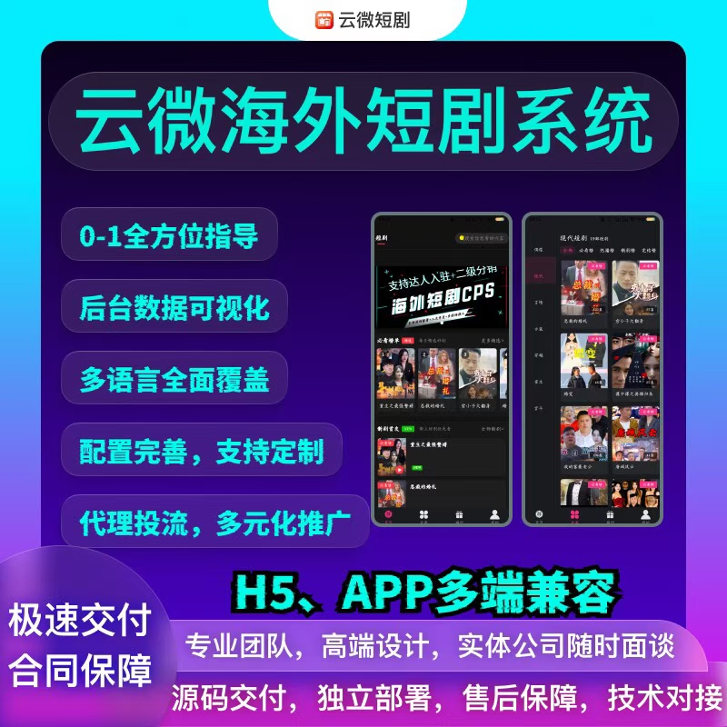

# 云微海外短剧系统开发 | 全球化短剧出海一站式解决方案

云微海外短剧系统，专为短剧出海创业打造，提供从0到1全流程指导与技术支撑。以多语言覆盖、多端兼容为核心，搭配完善配置与定制化能力，融合代理投流、分销裂变等运营功能，源码全交付+独立部署，实体公司保障，专业团队全程护航，助力快速抢占全球短剧市场红利。

### 一、核心服务优势：出海无忧，全程赋能

-  **0-1全方位指导** ：从需求规划、部署上线到运营推广，提供全流程一对一指导，新手也能轻松上手；

-  **全球化适配能力** ：多语言全面覆盖，一键翻译功能适配全球主流市场，真正实现“一套系统打遍全球”；

-  **多端兼容体验** ：支持APP（Android/iOS）、H5多端适配，一套代码通用，省时省力更省开发预算；

-  **专业团队保障** ：实体公司可随时面谈，高端UI设计+资深研发团队，技术对接与售后全程护航；

-  **源码独立部署** ：全源码交付搭配详细部署文档，自主掌控数据与运营权，轻松上架各大应用市场。

### 二、核心功能模块：全链路覆盖，适配海外运营

#### 1. 全球化基础能力

-  **多语言智能切换** ：支持全球主流语言，搭配一键翻译功能，本地化精准适配，覆盖北美、东南亚、中东等市场；

-  **多元登录适配** ：集成谷歌、脸书海外社交账号登录，兼容游客、手机号、邮箱登录，降低用户注册门槛；

-  **国际支付对接** ：稳定接入PayPal、Stripe国际支付渠道，支持单剧购买、会员订阅，付费流程顺畅便捷。

#### 2. 高效运营功能

-  **短剧高效管理** ：支持短剧一键导入，积分规则一键设置，快速搭建内容库与用户激励体系；

-  **数据可视化管理** ：全新订单数据统计表+后台数据看板，实时监控运营数据，决策有依据；

-  **用户裂变体系** ：完整分销机制+多等级会员制度，搭配VIP、卡密、积分等功能，强力促进用户裂变与留存。

#### 3. 技术与交付保障

-  **一套代码多端通用** ：无需重复开发，大幅降低开发成本与周期，加速项目落地；

-  **源码交付+部署支持** ：提供完整源码与详细部署文档，自主部署无依赖，数据安全可控；

-  **定制化与推广** ：功能配置完善，支持按需定制，配套代理投流与多元化推广方案，助力快速起量。

### 三、核心功能清单（10大核心亮点）

1. 多语言切换＋一键翻译，适配全球市场；
2. APP、H5多端兼容，全终端覆盖；
3. 谷歌、脸书、游客、手机号、邮箱多元登录；
4. PayPal、Stripe国际支付无缝对接；
5. 短剧一键导入，积分规则一键设置；
6. 全新订单数据统计表，运营数据清晰可查；
7. 集成VIP、卡密、积分等多元功能；
8. 完整分销体系+会员等级，驱动用户裂变；
9. 源码交付+详细部署文档，轻松上架运营；
10. 一套代码多端通用，降本增效。

### 商务微信：ywyy6798

支持标准化部署、定制化开发等灵活合作模式，价格可议，按需匹配不同创业场景与预算。

