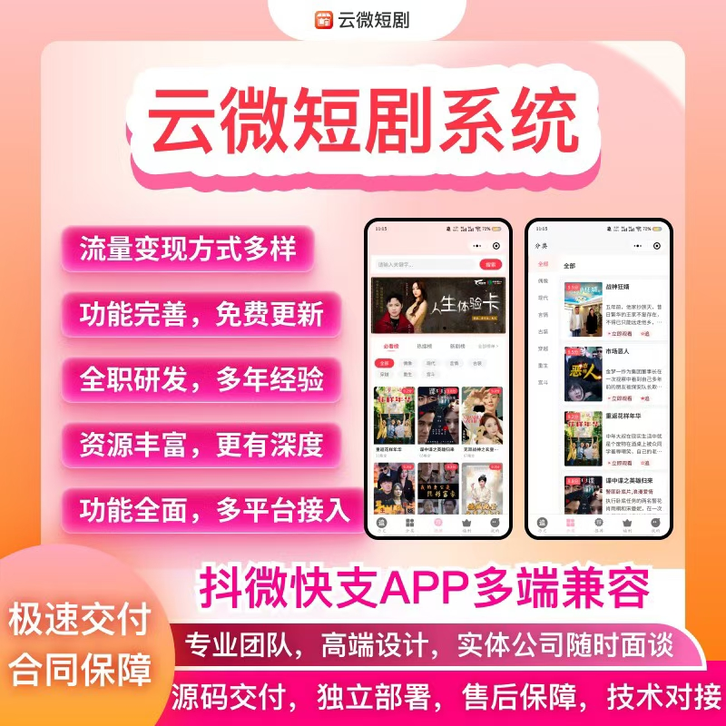

# 云微短剧系统定制开发｜付费 + 广告双模式，多广告联盟聚合一键接入

短剧赛道竞争加剧，单一变现模式难盈利、广告填充不稳、收益波动大，已成行业普遍痛点。

云微短剧系统定制开发，原生搭载付费 + 广告双变现引擎，一键聚合 20 + 主流广告联盟，兼顾用户留存与收益最大化，适配国内 / 海外全场景，助力平台稳定变现、快速回本。

### 1. 付费 + 广告双模式，双引擎驱动收益翻倍

- **广告变现（IAA）**：零门槛拉新，筑牢流量底盘。激励视频解锁剧集、开屏 / 插屏 / 信息流广告合规植入，免费用户零门槛观剧，快速起量、提升时长与留存。
- **付费变现（IAP）**：收割高价值用户，拉高收益上限。单集解锁、全集打包、会员订阅等多元付费场景，阶梯定价 + 新人特惠，降低首充门槛；付费用户屏蔽广告，沉浸式体验，付费率与客单价双高。
- **双模式灵活切换**：冷启动期以广告拉量，成熟期付费 + 广告混合运营，适配全运营周期，免费引流、付费转化，不浪费每一个用户。

### 2. 多广告联盟聚合，一键接入 + 智能优选，收益稳定

- **全渠道覆盖**：原生集成穿山甲、优量汇、百青藤、快手联盟等国内联盟，以及 Google AdMob、Meta 等海外联盟，一键可视化配置，零代码操作，无需二次开发。
- **AI 智能调度**：毫秒级实时比价多联盟 ECPM，优先展示高单价广告；瀑布流填充，无高价时自动替补次级渠道，填充率稳定 95%+，杜绝空广告曝光。
- **精准场景匹配**：激励视频解锁、开屏、插屏、剧情中插全场景覆盖；按用户地域、机型、时段自动匹配高溢价广告，提升完播率与转化率。

### 3. 定制化开发，打造专属平台，构建差异化壁垒

- **全品牌贴牌**：自定义 UI 界面、LOGO、品牌名称，打造专属品牌形象；支持私有化部署，数据 100% 自主掌控，规避封号与数据泄露风险。
- **功能深度定制**：新增漫剧、小说推文、直播带货等模块；对接自有推客分销、会员体系；定制专属运营规则，构建差异化壁垒。
- **多端适配**：小程序 + H5+APP 三端互通，用户无需下载，点击即看；支持剧集批量导入、分类管理、防录屏、防盗版，保护内容安全。

### 4. 数据化运营 + 合规保障，长期稳定盈利

- **可视化数据看板**：实时查看用户、剧集、订单、收益数据，核心指标一目了然；用户分层管理，按活跃度、付费能力分级，精准推送内容与活动。
- **合规适配**：内置海外隐私合规体系，适配 GDPR 等全球法规；自带多语言隐私协议，减少下架隐患；内容风控、防录屏、防盗链机制，保障平台长期稳定运营。

## 🤝 商务微信：ywyy6798

云微短剧系统定制开发，以付费 + 广告双模式为核心，多广告联盟聚合为抓手，定制化开发为支撑，助力平台快速起量、稳定变现、长期盈利，抓住短剧出海流量红利。

